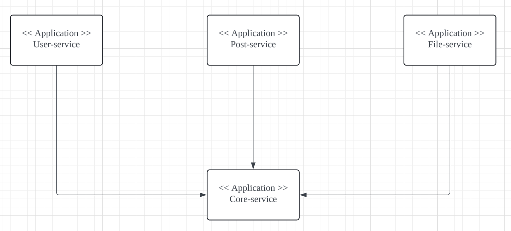
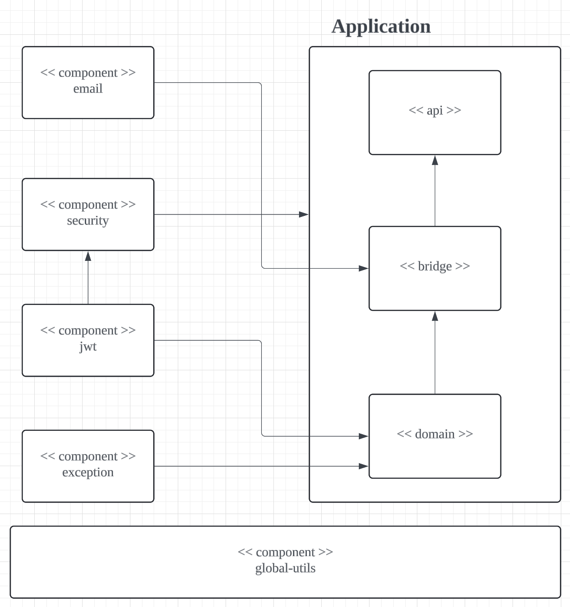

# 모듈화_프로그래밍

## 자바 9버전 이전의 한계
### 캡슐화의 한계
- 접근 제한자(private, protected etc)와 패키지 조합을 통해 다양한 형태의 캡슐화를 구현
- '동일 컴포넌트의 다른 패키지에서 해당 클래스에 접근하는 경우는 허용하고, 외부 컴포넌트에서의 접근은 막고 싶은 경우' -> 충족 할 수 없다.

### 클래스 패스 지옥
- 클래스들은 지연 로딩 방식을 따르기 때문에 애플리케이션의 버튼을 처음 클릭할 때 로딩될 수 있다.
- 클래스 패스에 중복 클래스가 있는 경우 쉽게 발견하기 어려우며 이는 런타임 에러를 발생시킨다.

이런 한계를 극복하기 위해 `모듈화` 개념이 등장했다. 모듈화는 다음과 같은 장점을 가진다.
1. 안정적인 구성 : 모듈 시스템은 코드를 컴파일하거나 실행하기 전에 주어진 모듈의 조합이 모드 의존성을 만족시키는지 체크한다.
2. 강력한 캡슐화 :
    - 다른 모듈에 무엇을 노출할지 명시적으로 선택하기 때문에 내부 구현 코드에 대하여 의도하지 않은 의존성 발생을 방지할 수 있다.
    - 캡슐화는 JVM의 가장 하위 레이어에서 이루어지고 있다. 민감한 내부 클래스에 대한 리플렉션 접근이 불가능하기 때문에 런타임에서 발생할 수 있는 공격 영역을 제한한다.
3. 최적화
    - 배포용 모듈을 최소한으로 구성할 수 있는 가능성을 열어준다.
    - 어떤 모듈이 함께 동작하는지 알기 때문에 JVM이 시작되는 동안 다른 코드를 고려할 필요가 없다.

## 모듈과 모듈화
### 모듈이란
- 모듈(module)이란 **관심사가** 같은 데이터와 함수를 하나로 묶어 **재활용**될 수 있는 프로그램 덩어리
- 이름, 연관된 코드, 기타 리소스를 그룹화하고 모듈 디스크리벝에 의해 설명된다.

> 모듈화(modularization)란 **독립적**이고 **재활용** 가능한 모듈로 분리하는 설계 기법

### 왜 모듈화를 해야하는가?
1. 유지보수의 용이성
    - 각각의 모듈은 독립적이기 때문에 해당 모듈만 수정하거나 교체할 수 있다.
    - 프로젝트 단위가 줄어들어 유지보수가 용이해진다.
2. 재사용성 : 개발된 모듈을 다른 프로젝트에서 사용이 가능하다.
3. 협업의 용이성 : 여러 팀이 동시에 다양한 모듈 작업을 진행할 수 있다.
4. 테스트와 디버깅의 용이성 : 각 모듈은 독립적으로 테스트할 수 있으므로 시스템의 다른 부분에 영향을 주지않고 테스트를 진행할 수 있다.

### 어떻게 모듈화를 할 것인가?
> 단일 책임, 독립성, 재활용, 명시적 의존성 측면을 고려해 모듈화 한다.

## 모듈화 적용
### 첫 번째 시도

- 도메인을 Aggregate 즉, 데이터 변경의 단위로 묶어서 서비스를 나누었다.
- 여기서 도메인은 `프로그래밍으로 해결하고자 하는 주제`

#### 문제점
1. 다른 모듈에서 공통적으로 사용되는 의존성을 Core-Service에 추가하다 보니 불필요한 의존성을 갖게 되는 문제가 생김.
   - Core-Service의 `OpenFeign` 의존성은 `File-Service`에서는 사용하지 않는 의존성
   - 프로젝트 간의 의존성 확인이 어려웠음. 
2. 계층 별로 완벽한 캡슐화를 달성하기 어려웠음.
   - 실제로 리팩토링 하는 과정에서 계층의 관계가 모호해지고 있음을 확인함.
   - Service 계층에서 외부 시스템을 호출하는 코드

### 두 번째 시도
- 재활용, 독립성, 단일 책임을 기준으로 모듈을 분리한다.
- Core-Service를 `Component`와 `Global Utils` 단위로 분리한다.

#### 🔍 [ ️Global Utils ]
- **"가능한 사용하지 않는다"** 를 기본 원칙으로 한다.
- Pure Java로 구성된다.
- 모든 프로그램에 전역적으로 사용될 수 있는 코드가 여기에 들어간다.
- `Utils 클래스`, `응답 코드`

#### 🔍 [ Component ]
- Pure Java로 사용할 수는 없지만, 많은 모듈에서 공통적으로 사용될 수 있는 모듈
- 예외 처리 모듈, JWT모듈, 시큐리티 모듈(?)
- `Jwt 모듈`, `Security 모듈`, `예외 처리 모듈`

#### 🔍 [ Application ]
- 각 서비스에 필요한 모듈을 모두 임포트하기에 SpringBoot Main실행 파일만 위치시킨다.
- 필요한 빈 들을 등록하고 관리할 수 있도록 Config 설정을 한다.
- `UserService`, `PostService`, `FileService` 등

> Core-Service를 작은 단위로 분리함으로써 불필요한 의존성 전파를 줄일 수 있었음.

### 세 번째 시도
- Application 계층에서 완벽한 캡슐화를 달성하기 어려웠음.
- 서비스 안에서의 의존성 격리와 유지보수성 증가를 위해 Application 모듈도 다시 모듈화 함.

#### 🔍 API
- Controller
- 사용자의 요청을 받고 응답을 반환하는 역할을 한다.

#### 🔍 Bridge
- API와 Service 사이에서 데이터를 가공하거나 변환하는 역할을 한다.

#### 🔍 Domain
- Entity, Repository, Service를 정의한다.